@mhkeller/notify
===

[](https://github.com/mhkeller/notify/actions/workflows/node.js.yml)
[](https://www.npmjs.com/package/@mhkeller/notify)

## Install

```sh
npm install --save @mhkeller/notify
```

## Usage

Pass an object to the `notify` function with the following options:

* `m` — `{String}` The message.
* `v` — `{String}` The value.
* `d` — `{String|String[]|Object}` Display options. The display style. Can be a [chalk style](https://github.com/chalk/chalk) name, array of chalk styles, the name of a [built-in display](#built-in-displays) or a [display config](#advanced-styling).
* `k` — `{Boolean}` [false] Whether to show a desktop notification using [node-notifier](https://github.com/mikaelbr/node-notifier)
* `error` — `{Error}` Pass an error object to get printed out with `console.error` for reference.
* `x` — `{Object}` An object that will extend the display. This is useful if you're setting a string or an array of string colors in `d` and you want to extend the display in a quick way.

All of these are optional. If you omit either the message or the value, that part of the notification won't appear. If you omit a display, it will use the default which bolds the value portion.

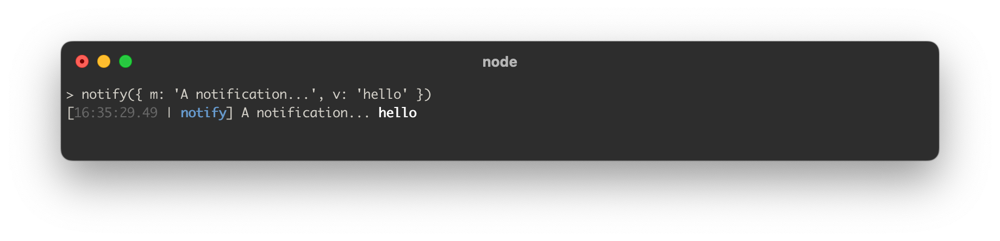

```js
import notify from '@mhkeller/notify'

notify({ m: 'A notification...', v: 'hello', d: 'magenta' });
```

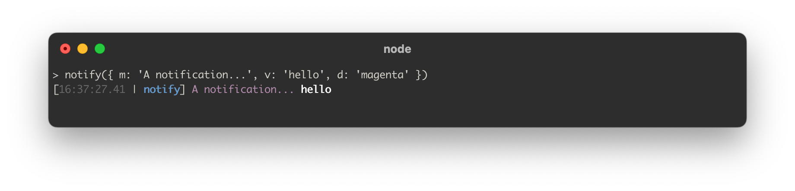

## Built-in displays

The [chalk styles](https://github.com/chalk/chalk) passed to `d` can be a single string, an array of strings or the name of one of the built-in display styles:

```js
// String
notify({ m: 'A notification...', v: 'hello', d: 'cyan' });
```

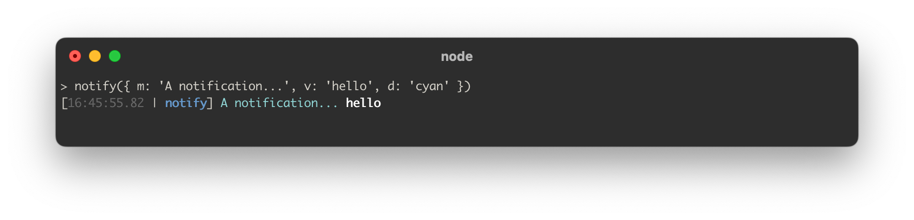

```js
// Array of strings
notify({ m: 'A notification...', v: 'hello', d: ['magenta', 'bold', 'italic', 'underline'] });
```

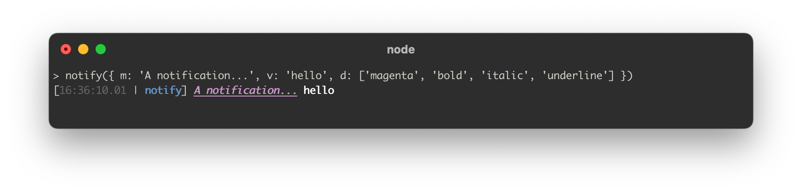

```js
// Display name
notify({ m: 'A notification...', v: 'hello', d: 'header' });
```

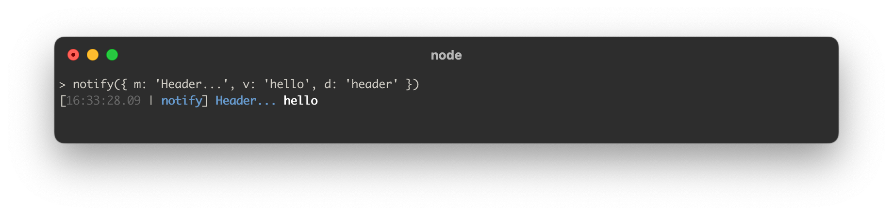

Here's the full list of built-in display names:

```js
{
  header: ['blue', 'bold'],
  group: ['magenta', 'bold'],
  task: ['cyan', 'bold'],
  note: ['gray', 'italic'],
  error: {
    messageStyle: 'red',
    desktop: true,
    level: 'error'
  },
  warn: {
    messageStyle: ['yellow', 'bold'],
    level: 'warn'
  },
  change: {
    preString: '\n',
    messageStyle: 'cyan'
  },
  success: ['green', 'bold']
}
```

**`header`**


**`group`**

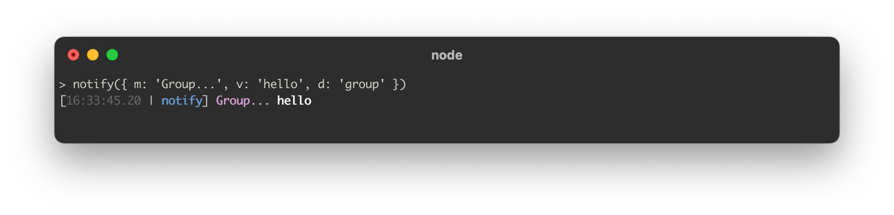

**`task`**

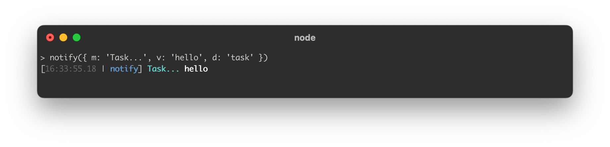

**`note`**

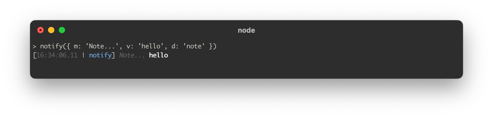

**`error`**

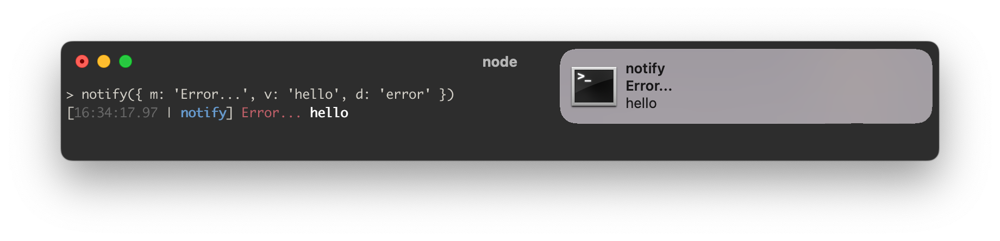

**`warn`**

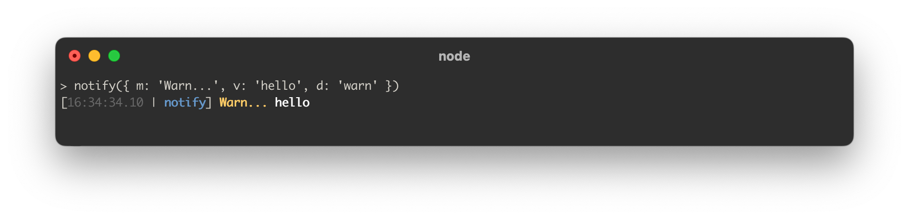

**`change`**

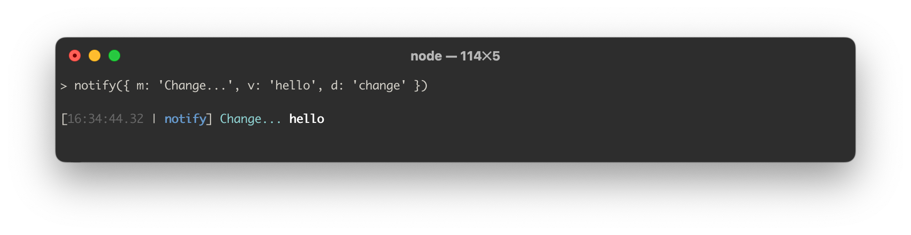

**`success`**

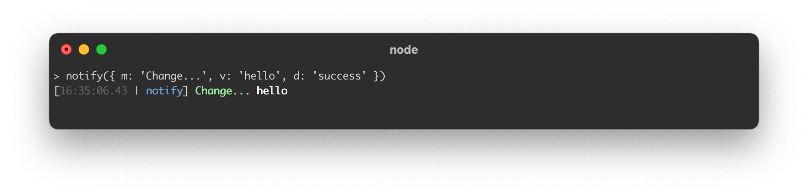


## Advanced styling

You can also pass a display config object to the `d` key. Any keys you don't set will be filled in with the default values:

```js
{
  messageStyle: '',
  valueStyle: 'bold',
  preString: '', // A string that goes before the timestamp. Useful if you want to put a line break character '\n'
  postString: '', // Same as pre-string but it gets added to the end
  skipPrefix: false, // Skip the bracketed timestamp + project name portion, called the prefix
  prefixStyle: { // Styling for the prefix
    open: '[',
    close: ']',
    sep: '|',
    timestampStyle: 'gray',
    projectNameStyle: ['blue', 'bold']
  },
  projectName: null, // By default, this is the name of your project directory but you can manually set it to something else here
  time: null, // By default, this is the current time, but you can manually set it to something else here
  desktop: false, // Show a desktop notification
  level: 'log' // Can be 'log', 'warn' or 'error'. Whether the notification gets called through `console.log`, `console.warn` or `console.error`.
}
```
